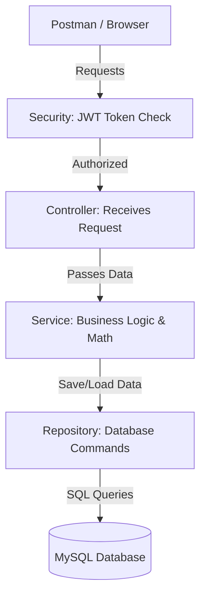

# Zorvyn Finance - Backend Application

Welcome to the **Zorvyn Finance Backend Project**! 

This project acts as the secure foundational core of a finance tracking application, utilizing a RESTful N-Tier Architecture to manage user data, execute complex aggregation logic, and enforce explicit method-level authorization protocols.

---

## 📖 What Does This Project Do?

This application provides a secure way to manage financial data. It allows users to:
1. **Register and Log in** securely.
2. **Add, Edit, View, and Delete** financial records (like logging a new paycheck or a grocery expense).
3. **View a Dashboard Summary** that automatically calculates Total Income, Total Expenses, and Net Balance.
4. **Enforce Rules (Access Control):** It prevents a simple "Viewer" from deleting data, only allowing "Admins" to make major changes.

---

## 🏗️ System Architecture & Layered Design

This project uses Java and Spring Boot. To ensure maximum code maintainability and separation of concerns, the application strictly adheres to the N-Tier layered architecture pattern:

- **`/controller` (API Endpoints):** 
  These classes intercept incoming HTTP REST requests, validate structural payloads, and route logic down to the internal Services.
- **`/service` (Business Logic Layer):** 
  This layer handles all core business logic and computational requirements, abstracting complexity away from the controllers.
- **`/repository` (Data Access Layer):** 
  Utilizes Spring Data JPA paradigms to interface directly with the MySQL relational database for persistence and retrieval.
- **`/entity` (Domain Models):** 
  Strictly typed JPA blueprints representing database schemas governing data integrity (e.g., `FinancialRecord.java`).
- **`/security` (Authorization Models):** 
  Incorporates a custom stateless `JwtAuthenticationFilter` configuration to parse Bearer tokens and enforce explicit API security.

---

## 🔒 Security & Rules We Added

1. **Tokens (JWT):** We don't use simple passwords for every request. Once a user logs in, they get a "Token". They use this token for all future requests to prove who they are.
2. **Access Levels:** 
   - **Admins:** Can do everything (Create, Edit, Delete).
   - **Analysts:** Can view records and summaries but cannot edit data.
   - **Viewers:** Can only look at data.
3. **Data Protection:** We wrote rules (Validations) so no one can accidentally submit a financial record with a negative amount or an empty date!

---

## 🗺️ Project Architecture Flowchart



---

## 🚀 How to Run the Project on Your Computer

1. **Set up the Database:** 
   Make sure you have MySQL installed on your computer. Open your MySQL tool and create a new database called `finance_project`.
2. **Database Passwords:**
   Open `src/main/resources/application.properties` and change the `root` username and password to whatever you use for your local MySQL.
3. **Start the Code:**
   Open your terminal in the backend folder and run this command:
   ```bash
   ./mvnw spring-boot:run
   ```
4. **Test the Code:**
   Check out the `API_Documentation.md` file included in this project. It provides a formal breakdown of the endpoints, payload structures, and security logic so you can correctly interact with the API!
