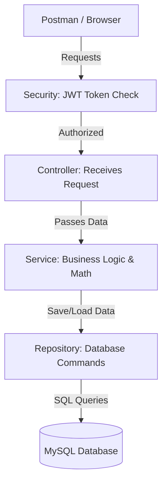

# Zorvyn Finance - Backend Application

Welcome to the **Zorvyn Finance Backend Project**! 

If you are new to programming, think of this project as the "brain" and "filing cabinet" of a finance tracking application. It doesn't have a visual website design (frontend) yet. Instead, it securely manages data, calculates totals, and decides who is allowed to view or edit financial records.

---

## 📖 What Does This Project Do?

This application provides a secure way to manage financial data. It allows users to:
1. **Register and Log in** securely.
2. **Add, Edit, View, and Delete** financial records (like logging a new paycheck or a grocery expense).
3. **View a Dashboard Summary** that automatically calculates Total Income, Total Expenses, and Net Balance.
4. **Enforce Rules (Access Control):** It prevents a simple "Viewer" from deleting data, only allowing "Admins" to make major changes.

---

## 🏗️ How the Code is Organized (Beginner's Guide)

This project uses Java and Spring Boot. To keep things clean, the code is split into specific folders based on what the code does. This is a very common professional practice!

- **`/controller` (The Receptionists):** 
  These files listen for internet requests (like someone asking to log in or save a new record). They check the request and hand it over to the Services.
- **`/service` (The Brain):** 
  This is where the actual logic happens. If the Dashboard needs the "Total Net Balance", the Service does the math.
- **`/repository` (The Filing Cabinets):** 
  These files talk directly to the MySQL Database. They handle saving, finding, and deleting rows of data.
- **`/entity` (The Blueprints):** 
  These files define what our data looks like. For example, `FinancialRecord.java` states that every record must have an `amount`, a `date`, and a `category` (like Income or Expense).
- **`/security` (The Bouncers):** 
  These files check the user's "Token" (ID Badge) to make sure they are actually logged in and allowed to access the data.

---

## 🔒 Security & Rules We Added

1. **Tokens (JWT):** We don't use simple passwords for every request. Once a user logs in, they get a "Token". They use this token for all future requests to prove who they are.
2. **Access Levels:** 
   - **Admins:** Can do everything (Create, Edit, Delete).
   - **Analysts:** Can view records and summaries but cannot edit data.
   - **Viewers:** Can only look at data.
3. **Data Protection:** We wrote rules (Validations) so no one can accidentally submit a financial record with a negative amount or an empty date!

---

## 🗺️ Project Architecture Flowchart



---

## 🚀 How to Run the Project on Your Computer

1. **Set up the Database:** 
   Make sure you have MySQL installed on your computer. Open your MySQL tool and create a new database called `finance_project`.
2. **Database Passwords:**
   Open `src/main/resources/application.properties` and change the `root` username and password to whatever you use for your local MySQL.
3. **Start the Code:**
   Open your terminal in the backend folder and run this command:
   ```bash
   ./mvnw spring-boot:run
   ```
4. **Test the Code:**
   Check out the `API_Documentation.md` file included in this project. It provides a formal breakdown of the endpoints, payload structures, and security logic so you can correctly interact with the API!
